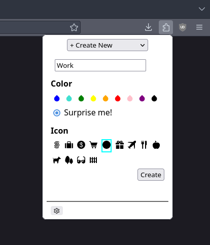
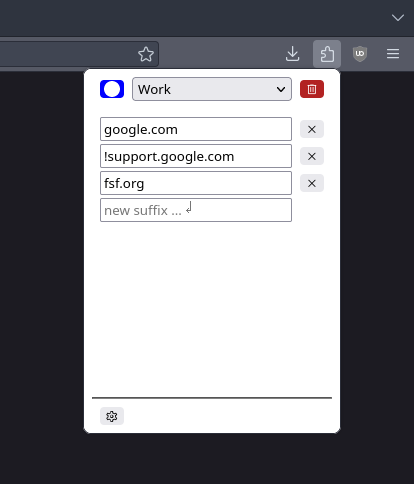

# Cubicle
  
Cubicle is a flexible container manager extension for browsers.

#### Screenshots

### Features:
- Create temporary containers by websites' suffixes;
- Customizable behaviours for tabs in temporary containers;
- Personalize container look and feels in the same place;
- Import from existing containers with ease;

### Setup
Since this extension is not signed, the configuration
`xpinstall.signatures.required` should be set to `false` in `about:config`.

1. Navigate to the `Artifacts` tab under the `Build` tab in the side menu.
2. Press the download button besides the latest successful `build` job.
3. Extract the archive to obatin the `.xpi` file.
4. Navigate to `about:addons` in Mozilla Firefox.
5. Press the settings button next to the heading and select `Install Add-on From File...`.
6. Choose the `.xpi` file in the dialog and select the appropriate options in the warning popup.
